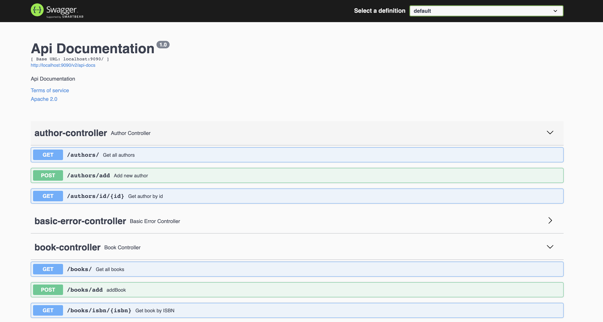
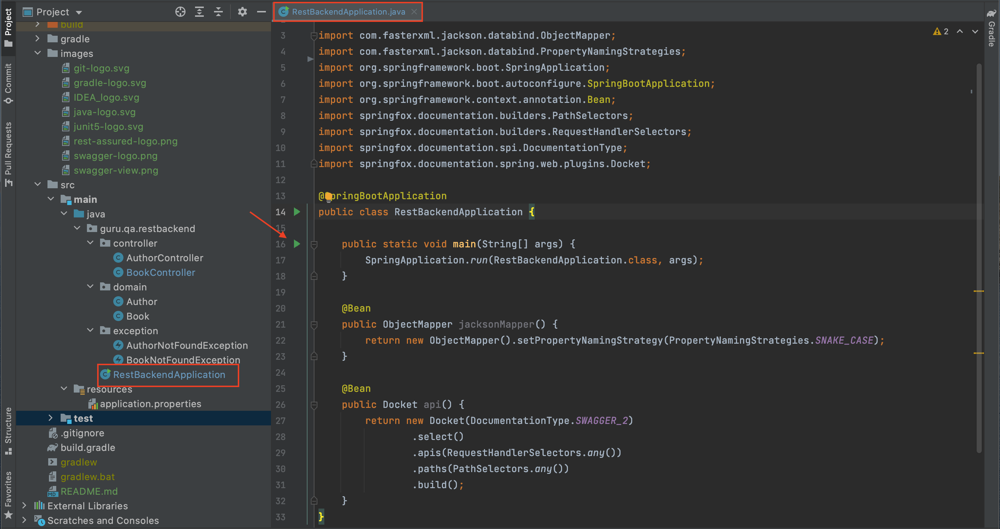
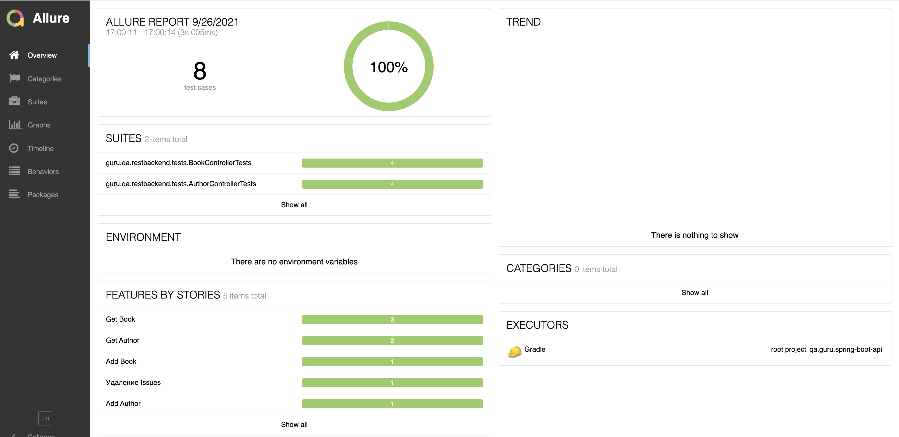
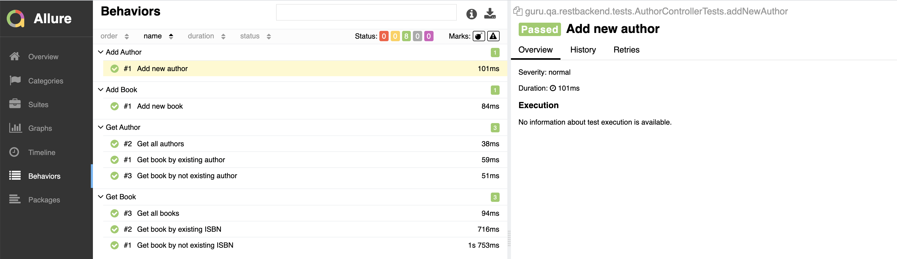

# REST API Service Project

### Used Technologies & Tools:
<p align="left">


</p>

### Swagger as a REST API Service Self-Documentation:
Swagger is available on by link http://localhost:9090/swagger-ui/ after Service is started.


### How To Run Service:
The repository should be cloned and Service should be started. Service runs locally on 9090 port.


### List of the Automated Tests:
- [X] Get all books
- [X] Get book by existing ISBN
- [X] Get book by existing ISBN
- [X] Get book by not existing ISBN
- [X] Add new book
- [X] Get all authors
- [X] Get book by existing author
- [X] Get book by not existing author
- [X] Add new author

### How To Run Tests </br>
```bash
gradle clean test apiTests
```

### Allure Report For Test Results Presentation
#### How to Run Allure Report
After tests are executed run the following command at Terminal
```bash
gradle allureServe
```
or run report using GUI


#### Allure Report Results




:heart: <a target="_blank" href="https://qa.guru">qa.guru</a><br/>
:blue_heart: <a target="_blank" href="https://t.me/qa_automation">t.me/qa_automation</a>